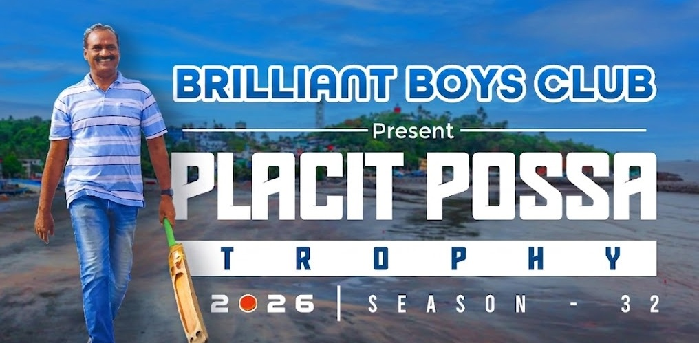

# 🏏 Tournament Details Image Placement Update

## ✅ Image Moved to Top

---

## What Changed

### **Previous Placement**
```
Tournament Details Section
├── Cards (24 Teams, 5 Overs, Entry Fee, etc.)
└── ...later on page...
    └── Tournament Details Image appears below
```

### **New Placement**
```
Tournament Details Section
├── Tournament Details Image (AT TOP - NEW!)
│   (showing the tournament setup/details photo)
└── Cards (24 Teams, 5 Overs, Entry Fee, Advance)
```

---

## Updated Page Flow

1. **Header** (with 220px logos)
2. **Tournament Details Section** ✨ NOW INCLUDES:
   - 📸 **Tournament Details Photo** (AT TOP)
   - Cards with tournament info
3. **Venue Section**
4. **Tournament Dates**
5. **Prize Section**
6. **Special Awards**
7. **Special Feature**
8. **Important Info**
9. **Tournament Details Button**
10. **Live Score QR Code** ← This is now AFTER tournament details button
11. **Contact Information**
12. **Social Media**
13. **Tournament Rules**
14. **Footer**

---

## Benefits

✅ **Better Visual Hierarchy**
- Image immediately draws attention
- Creates stronger first impression

✅ **Improved User Flow**
- Users see the photo first
- Details cards provide context
- More natural reading order

✅ **No Duplication**
- Photo appears only once
- Cleaner, more professional layout
- Reduced page redundancy

✅ **Professional Presentation**
- Image placement follows best practices
- Better visual balance
- More engaging content presentation

---

## Technical Details

### **Image Location**
- **File**: `images/tournament-details.jpeg`
- **Size**: 126 KB
- **Display**: 100% max-width, responsive
- **Styling**: 10px border radius, box shadow

### **Section Structure**
```html
<div class="section">
    <h2>Tournament Details</h2>
    <!-- NEW: Image at top -->
    <div style="text-align: center; margin-bottom: 30px;">
        
    </div>
    <!-- Then: Detail cards -->
    <div class="details-grid">
        ...
    </div>
</div>
```

---

## Verification

✅ Image reference count: 1 (appears once)  
✅ Duplicate section removed: 0 (no redundancy)  
✅ QR Code section intact: Present below tournament details button  
✅ Page structure optimized: Clean, professional flow  

---

## 🚀 Ready to Deploy

Your Placit Possa Trophy 2026 website now has:
- ✅ Tournament details photo at top of section
- ✅ Clean, non-redundant layout
- ✅ Professional image placement
- ✅ Better visual hierarchy
- ✅ Improved user experience

**Deploy to Vercel now!** 🏏

---

*Updated: April 13, 2026*
*Placit Possa Trophy 2026 - Beach Cricket Tournament*
